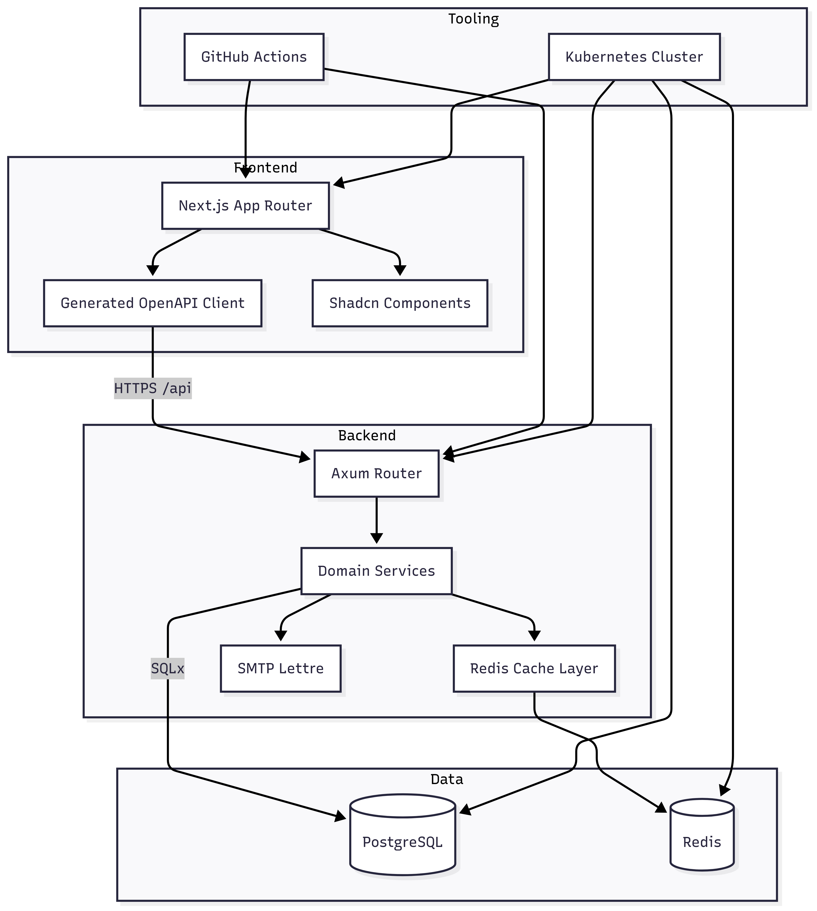

# Campus Life Events

Campus Life Events is a full-stack platform that helps campus organizations publish, review, and share events with calendar feeds and an administrative dashboard.\
It's developed by Neuland Ingolstadt e.V. and actively used by all campus organizations at TH Ingolstadt.

## Overview
- Rust/Axum REST API backed by PostgreSQL with Redis caching for public endpoints and iCal feeds
- Next.js 15 dashboard for organizers and admins built with React 19, TypeScript, Tailwind CSS v4, and shadcn/ui
- Monorepo layout with dedicated backend and frontend packages plus shared CI workflows

## Features
- Publish, approve, and archive events with localized content and scheduling metadata
- Delegate organizer access with role-based permissions and audit logging of actions
- Serve public event views and iCal feeds quickly through Redis-backed caching
- Manage newsletters, email notifications, and shareable event pages from the dashboard
- Provide responsive dark/light themed UI with accessibility considerations

## Architecture
- **Backend Services**: Axum routes handle authentication, organizers, events, and iCal generation; SQLx models manage persistence and invalidate Redis caches after mutations
- **Frontend Application**: Next.js App Router renders the dashboard, consumes the generated OpenAPI client, and uses TanStack Query for data interactions
- **Data & Messaging**: PostgreSQL 16 stores authoritative data while Redis keeps cached responses; optional SMTP integration handles transactional emails
- **Infrastructure**: Docker Compose (in `backend/`) provisions PostgreSQL and Redis locally; GitHub Actions enforce formatting, linting and docker builds for both backend and frontend

## Architecture

## Technology Stack
- Backend: Rust 1.81+, Axum 0.8, SQLx, Redis, PostgreSQL 16, utoipa, Argon2, Lettre
- Frontend: Next.js 15, React 19, TypeScript, Tailwind CSS v4, TanStack Query, React Hook Form, Zod
- Data: PostgreSQL, Redis

## Licensing
Licensed under the AGPL-3.0. See [LICENSE](LICENSE) for details.
